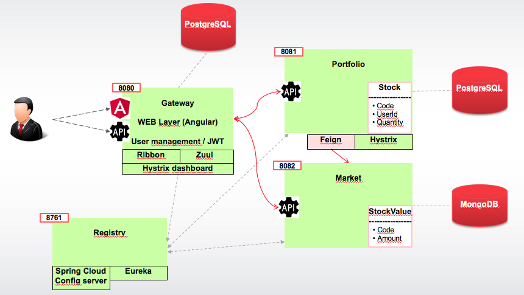
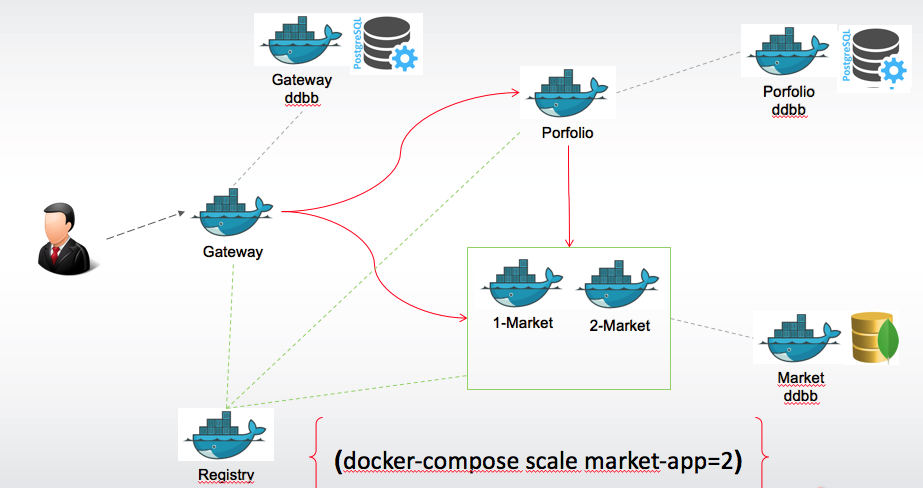

# jhipster-microservices-demo

Application create like a demo to show the microservice based on [Spring Cloud Netflix](https://cloud.spring.io/spring-cloud-netflix/) created using [JHipster microservice](http://www.jhipster.tech/microservices-architecture/)


## Objetives
* Use JHipster to create the microservices
* Use the patterns Spring Cloud Netflix
    * Zuul - Gateway
    * Spring Cloud Config - For a central configuration
    * Ribbon - For client load balancing
    * Eureka - For discovering service
    * Feign - A client to call a microservice
    * Hystrix - Circuit breaker 

## Demo Requirement
* Functional Requirements
   * Application to manage a personal stock portfolio and the value of stocks in a market.
   * Each user will see his onwer portfolio
   * From detail of stock (portfolio) should be possible to show the price of stock (market)

* Technical Requiriments
    * Horizontal/Vertical scale 
    * Security (JWT)
    * Application web on Angular

* Functional Entities. This correspond with the entities that application wants to manteains. (It's not include the seciruty, just the stokcs and the values)

    > **Stock** (Portfolio)
    
    | Name | Description | 
    | --- | -- |
    | id | internal id|
    | code | code of stock. i.e: SAN |
    | userId | UserId or owner of this stock|
    | Quantity | Number of stocks |

     

    > **StockValue** (Market)

    | Name | Description | 
    | --- | -- |
    | id | internal id|
    | code | code of stock. i.e: SAN |
    | amount | price of stock |

 

## Arquitecture
This demo consist in 4 different applications, which can be describe:

* Gateway - Microservice. Edge-service and also contains the web application (angular). This gateway also contains a bbdd to maintains the users and security. Here is where is used the zuul proxy pattern.

* Portfolio - Microservice. Contains the bussiness logic of Stock. From the stock details restpoint is call to microservice market to retrive the price of a stock code (Use of Feign / Hystrix). Use a postGresSQL bbdd 

* Market - Microsercive. Contains the bussiness logic to keep the ValueStock entities. Use a MongoDB bbdd 

* Registry - Eureka server / Cloud Config server. Application taked from [JHister Registry](https://github.com/jhipster/jhipster-registry)

See visual representation of the architecture:



## Docker
For demo and thanks to JHipster commands, it has been prepare a docker-compose file to start all the images. Notices that you need prepare first to local images previous to start.

See the picture of how is the representation of dockers instances:


See in docker folder the [readme](docker/README-DOCKER-COMPOSE.md) and the files [docker-compose.yml](docker/docker-compose.yml) and [jhipster-registry.yml](docker/jhipster-registry)


## Useful commands 

### Start in a DEV Mode

Open a terminal for start mongoDb
```
docker-compose -f src/main/docker/mongodb.yml up
```

Open a terminal for each application and located in each directory
1. jhipster-registry
2. gateway
3. portfolio
4. market
and start the applications in order 
```
./mvnw 
```
Also could be (from each terminal):
```
cd jhipster-registry && yarn && ./mvnw
cd gateway && yarn && ./mvnw
cd portfolio && yarn && ./mvnw
cd market && yarn && ./mvnw
```

If you want start in web dev mode (from the gateway folder where is located the web application)
```
yarn start
```

### To generate docker image
In case of MAC, just make sure that you are start the docker machine and set the enviroment.
```
docker-machine start default
docker-machine env
eval $(docker-machine env)
```

Then, to generate the local image
For Registry:
```
./mvnw clean package -Pprod docker:build -DskipTests
```

For gateway/portfolio/market:
```
./mvnw clean package -Pprod dockerfile:build -DskipTests
```

### docker-compose

To start and stop:
```
docker-compose up -d
docker-compose stop
```

To scale the microservice market:
```
docker-compose scale market-app=2
```


